### AI Enthusiast • Full-Stack Developer • Machine Learning Explorer

---

## About Me

I'm a passionate developer with a strong foundation in full-stack development and a growing expertise in AI and Machine Learning. I enjoy creating efficient, scalable solutions that bridge the gap between complex backend systems and intuitive user interfaces.

Currently pursuing advanced knowledge in artificial intelligence while building robust applications using modern technologies. I believe in writing clean, maintainable code and staying updated with the latest industry trends.

## Technical Skills

### Languages & Frameworks

### Frontend Development

### Backend Development

### Database & Cloud

### Tools & Technologies

## Current Learning Journey

🧠 **Artificial Intelligence & Machine Learning**
- Deep Learning fundamentals and neural network architectures
- Natural Language Processing and computer vision applications
- MLOps practices and model deployment strategies

🔬 **Advanced Development Practices**
- Microservices architecture and distributed systems
- Cloud-native development patterns
- Performance optimization and scalability

## GitHub Analytics

## Let's Connect

I'm always interested in discussing new technologies, collaborating on innovative projects, or exploring opportunities in AI and full-stack development.

---

*"The best way to predict the future is to create it."*

\`\`\`
---

## 🚀 About Me

\`\`\`javascript
const prathmesh = {
    pronouns: "He" | "Him",
    code: ["JavaScript", "TypeScript", "Python", "Java", "Kotlin", "Dart"],
    askMeAbout: ["web dev", "mobile dev", "tech", "app dev", "system design"],
    technologies: {
        frontEnd: {
            js: ["React", "Next.js", "Vue"],
            css: ["Tailwind", "Bootstrap", "Material-UI"],
            mobile: ["Flutter", "React Native", "Kotlin"]
        },
        backEnd: {
            js: ["Node", "Express", "Fastify"],
            python: ["Django", "FastAPI", "Flask"],
            java: ["Spring Boot"],
            misc: ["Ruby on Rails"]
        },
        databases: ["PostgreSQL", "MongoDB", "MySQL", "Firebase", "Redis"],
        devOps: ["AWS", "Docker", "Kubernetes", "CI/CD", "Nginx"],
        tools: ["Git", "Postman", "VS Code", "Figma", "Linux"]
    },
    currentProject: "Building EONE - E-Classroom Management Platform",
    funFact: "I debug with console.log() and I'm not ashamed! 😄"
};
\`\`\`

---

## 🛠️ Tech Stack

### Frontend

### Backend

### Database & Cloud

---

## 🔥 Current Project: EONE Platform

  

### 🎯 **E-Classroom Management System**
> *Revolutionizing education through technology*

**🏗️ Multi-Platform Architecture:**
- 📱 **Mobile:** Flutter & Kotlin for seamless mobile experience
- 🌐 **Web:** React.js for responsive web interface  
- ⚙️ **Backend:** Spring Boot, Ruby on Rails & FastAPI microservices
- 🗄️ **Database:** PostgreSQL with local-first data handling

**👥 Role-Based Access:**
- 🔧 **Admin:** Complete system management
- 👨‍🏫 **Teacher:** Course creation & student management
- 🎓 **Student:** Interactive learning experience
- 🏢 **Company:** Corporate training modules

**📊 Progress Tracking:**
\`\`\`
Frontend Development  ████████████████████░░ 85%
Backend Services      ████████████████░░░░░░ 70%
Database Design       ████████████░░░░░░░░░░ 60%
Testing & QA          ████████░░░░░░░░░░░░░░ 40%
\`\`\`

---

## 📊 GitHub Stats

  
  

  

  

---

## 🏆 GitHub Trophies

  

---

## 🎯 What I'm Up To

- 🔭 Currently working on **EONE - E-Classroom Management Platform**
- 🌱 Learning **System Design, Microservices Architecture, and Cloud Computing**
- 👯 Looking to collaborate on **Open Source Projects and Innovative Web/Mobile Applications**
- 🤔 Exploring **AI/ML integration in web applications**
- 💬 Ask me about **React, Flutter, Spring Boot, System Design**
- 📫 Reach me at: **prathmesh@example.com**
- ⚡ Fun fact: **I can debug code faster with coffee ☕**

---

## 🌟 Featured Repositories

---

## 📈 Contribution Graph

  

---

## 🤝 Connect with Me

---

## 💝 Support My Work

If you like my work and want to support me, consider buying me a coffee! ☕

---

  

  <h3>💫 "Code is like humor. When you have to explain it, it's bad." – Cory House</h3>
  
  **Thanks for visiting! 😊**
  
  

